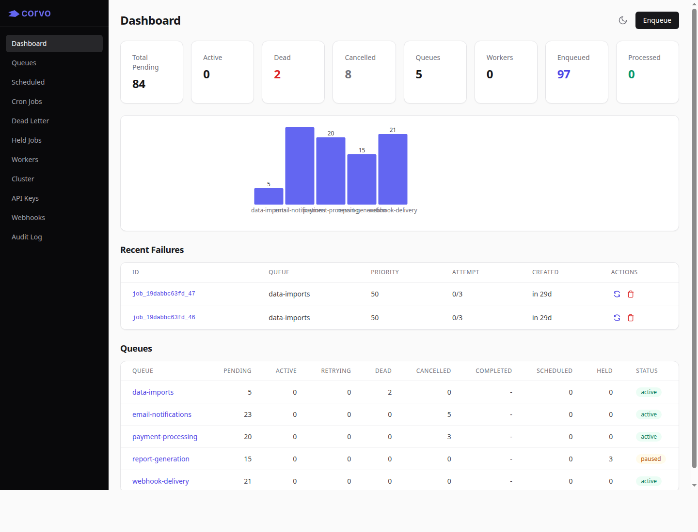
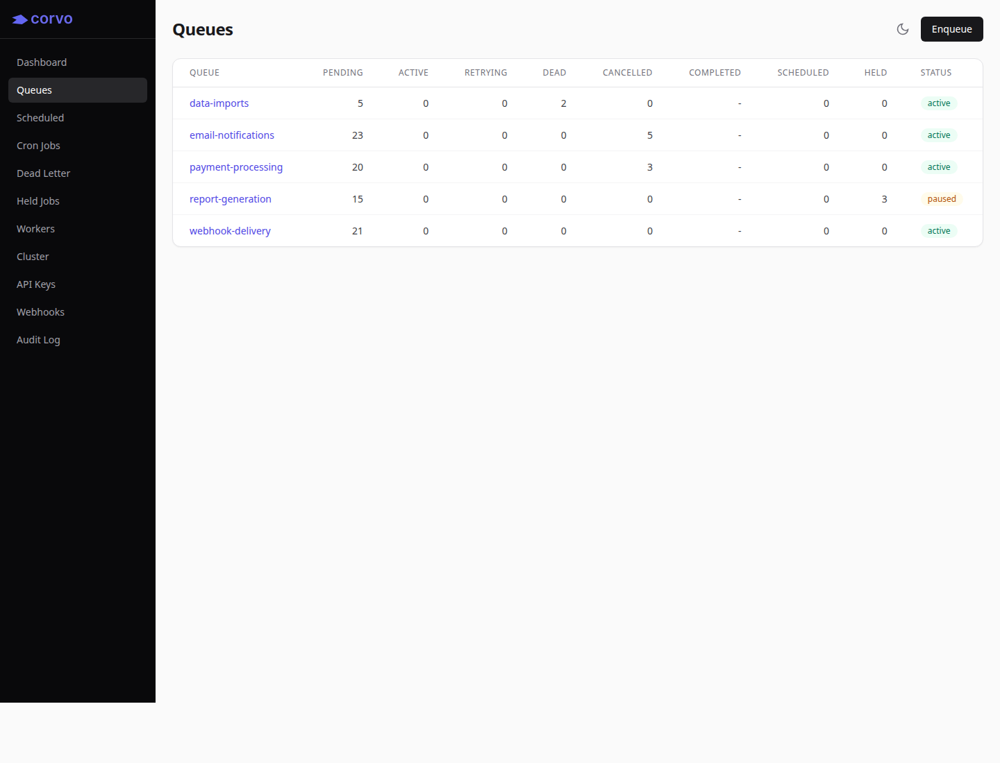
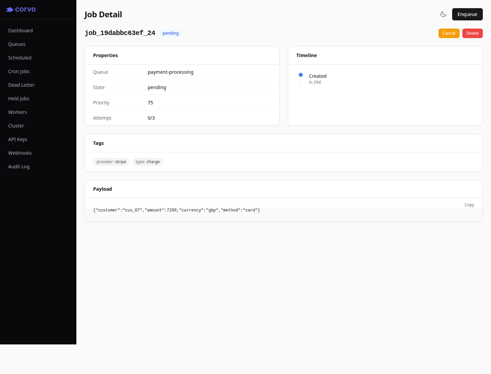
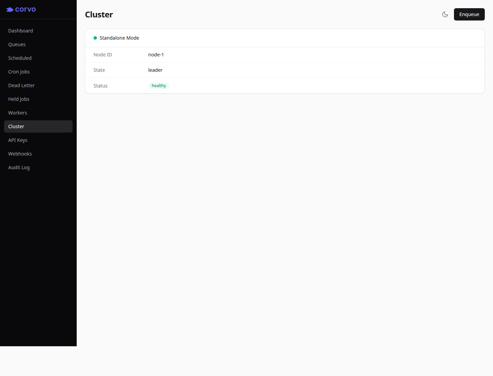

<p align="center">
  
</p>

**Corvo is an MIT-licensed distributed job system for background work.**

It runs as a single binary, stores state in Talon, and lets workers pull jobs over HTTP or Corvo's binary RPC protocol. No Redis. No Postgres. No external coordinator.

Corvo is built for teams that want a queue they can run themselves without assembling a stack of separate services.

---

## Quickstart

Build Corvo:

```bash
zig build -Doptimize=ReleaseFast
```

Start the server:

```bash
./zig-out/bin/corvo
```

Enqueue a job:

```bash
./zig-out/bin/corvo enqueue emails.send '{"to":"user@example.com"}'
```

Fetch work over HTTP:

```bash
curl -X POST http://localhost:9878/api/v1/fetch \
  -H "Content-Type: application/json" \
  -d '{"queues":["emails.send"],"worker_id":"worker-1","count":1}'
```

Workers acknowledge successful jobs with `POST /api/v1/ack/{id}` and report failures with `POST /api/v1/fail/{id}`. The API is plain HTTP, so workers can be written in any language.

---

## Screenshots

| Dashboard | Queues |
| --- | --- |
|  |  |

| Job detail | Cluster |
| --- | --- |
|  |  |

---

## What Corvo Is

Corvo is a durable background job system with built-in persistence, queue controls, and clustering.

It is useful for:

- background jobs
- async task processing
- scheduled work
- retryable workflows built from jobs
- queue-based worker fleets
- self-hosted infrastructure where Redis or Postgres should not be the queue

It is not trying to be a full workflow engine, message bus, or hosted platform.

---

## Core Features

### Jobs

- enqueue, fetch, ack, and fail lifecycle
- priorities
- delayed and scheduled jobs
- retries with backoff
- dead jobs
- TTL expiration
- unique jobs
- cancellation
- held jobs with approve / reject actions
- job chains
- batches with callbacks
- tags and metadata
- result, checkpoint, and progress storage

### Queues

- per-queue pause and resume
- queue drain and clear operations
- per-queue concurrency limits
- per-queue throttling
- global throttling
- fairness controls
- bulk actions against explicit job IDs

### Scheduling

- cron schedules
- manual cron trigger
- pause, resume, update, and delete schedules

### Operations

- built-in web UI
- CLI
- Prometheus metrics
- queue and worker inspection
- job search
- tag search
- API keys with roles
- webhooks
- audit logs
- backup and restore endpoints
- cluster status and event endpoints

---

## Architecture

Corvo is implemented in Zig around a single write pipeline and an embedded KV store.

| Component | Purpose |
| --- | --- |
| Pipeline | Classifies requests, batches work, applies state transitions |
| Talon | Embedded durable KV store used for Corvo state |
| KV read layer | Typed reads directly from Talon |
| Raft log | Replicated mutation log via zig-raft |
| Raft transport | Peer replication and follower catch-up (raft_net) |
| Raft elections | Leader election and cluster membership checks |
| HTTP / RPC | Worker and client protocols |

Talon is the storage engine. It uses a B+ tree plus value log layout, with job headers and indexes kept in the tree and larger payloads stored separately.

The current Zig implementation uses Talon plus Corvo's own replication path rather than the older storage architecture.

---

## Reliability Model

Corvo's delivery guarantee is:

> **At-least-once processing**

The system is designed around:

- durable state in Talon
- lease tokens for fetched jobs
- worker heartbeats
- automatic lease reclaim
- idempotent job acknowledgement
- snapshot-style backup and restore
- deterministic state transitions
- optional synchronous replication in cluster mode

Workers should still make job handlers idempotent. Corvo can prevent lost work, but it cannot make arbitrary side effects exactly-once.

---

## Clustering

Corvo can run as a single node or as a cluster.

Cluster mode uses leader election with primary-backup replication. The leader accepts writes, replicates mutations to followers, and can optionally defer responses until replication is acknowledged with `--sync-repl`.

Useful flags:

```bash
./zig-out/bin/corvo \
  --node-id node-a \
  --peers node-b@10.0.0.2:10878,node-c@10.0.0.3:10878 \
  --sync-repl
```

The cluster transport port defaults to `server port + 1000`.

---

## API

The HTTP API lives under `/api/v1`.

Common endpoints:

| Method | Path | Purpose |
| --- | --- | --- |
| `POST` | `/api/v1/enqueue` | Enqueue one or more jobs |
| `POST` | `/api/v1/fetch` | Fetch jobs for a worker |
| `POST` | `/api/v1/ack/{id}` | Acknowledge a job |
| `POST` | `/api/v1/fail/{id}` | Report job failure |
| `GET` | `/api/v1/jobs/{id}` | Inspect a job |
| `GET/POST` | `/api/v1/jobs` | List or search jobs |
| `GET` | `/api/v1/queues` | Queue stats |
| `GET` | `/api/v1/workers` | Worker list |
| `GET` | `/api/v1/cluster/status` | Cluster status |
| `POST` | `/api/v1/backup` | Create a backup |
| `POST` | `/api/v1/restore` | Start a restore |

The OpenAPI spec is maintained in `src/openapi.json`.

---

## CLI Examples

Inspect a job:

```bash
./zig-out/bin/corvo inspect <job-id>
```

Search jobs:

```bash
./zig-out/bin/corvo search --queue emails.send --state pending
```

Requeue a failed or dead job:

```bash
./zig-out/bin/corvo requeue <job-id>
```

Pause a queue:

```bash
./zig-out/bin/corvo pause emails.send
```

Apply a bulk action to explicit jobs:

```bash
./zig-out/bin/corvo bulk cancel --job-ids job-a,job-b,job-c
```

---

## Performance

Corvo includes local benchmark tools:

```bash
zig build bench-rpc
zig build bench
```

Benchmarks should be read as workload-specific. Lifecycle throughput is the more useful capacity number than enqueue-only burst throughput, because it includes fetch, work completion, and acknowledgement.

---

## When Not To Use Corvo

Corvo is probably not the right tool if:

- you only run a few background jobs
- you already operate a queue system you are happy with
- you need a full workflow engine with visual orchestration
- you need exactly-once side effects
- you want a hosted-only service instead of software you can run

---

## Corvo Console

The core Corvo server is MIT licensed.

Corvo Console is planned as a separate management plane for teams operating Corvo across clusters. The intent is to offer Console in self-hosted and hosted modes without turning the core job system into a crippled open-core product.

Console is not required to run Corvo.

---

## License

MIT. See [LICENSE.md](LICENSE.md).

---

## Support

If you are evaluating Corvo and want help running it:

```text
hello@corvohq.com
```

---

## Design Philosophy

Corvo prioritizes:

- predictable behavior
- operational simplicity
- explicit tradeoffs
- durable state
- worker portability

Not feature count.
